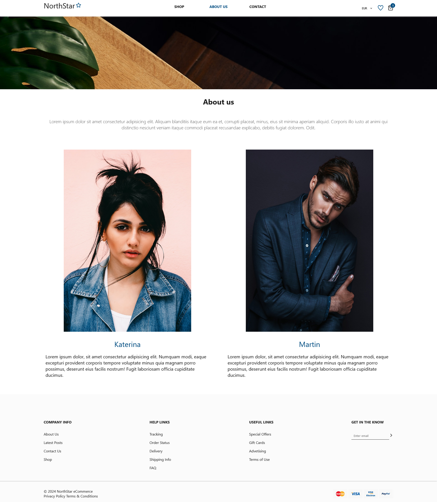

# NorthStar - E-commerce website

This shop was created using **Vite + React.js + React Router**. This project is a functional e-commerce application that allows users to browse products, add them to the shopping cart and to the favourites list. The website also includes contact and about pages.

## Live on Vercel

- front-end
  <a href="https://north-star-front.vercel.app/">NorthStar - eCommerce Fashion Website</a>

- back-end
  <a href="https://north-star-back-end.vercel.app/">NorthStar - back-end</a>


<p align="center">

</p>

## Table of contents

- [Features](#Features)
- [Technologies](#technologies)
- [Screenshots](#screenshots)

## Features

- **Product browsing**: on the home page, users can discover recently added items and top sellers, and on the shop page, users can see all available products and filter them by category.
- **Product details**: each product has its own detail page. On this page you can find out more details about the product and add it to your Favourites or, after selecting the size, to your shopping basket.
- **Favourites List**: liked items can be added to the Favourites list and later added directly to the shopping basket.
- **Shopping Cart**: allows you to add and remove items from the shopping cart, change quantities.
- option to change currency

## Technologies

<p align="left">
<a href="https://react.dev/"></a>
<a href="https://developer.mozilla.org/en-US/docs/Web/CSS?retiredLocale=pl"></a>
<a href="https://developer.mozilla.org/en-US/docs/Web/JavaScript"></a>

## Screenshots

### Home Page

  <p align="center">
  
  </p>

### Shop Page

  <p align="center">
  
  </p>

### Product Details

  <p align="center">
  
  </p>

### Favourites List

<p align="center">
  
  </p>

### Cart

<p align="center">
  
  </p>

### About us

<p align="center">
  
</p>

### Contact

<p align="center">
  
  
</p>

## Installation

To run this project, you must have the following dependencies installed:

- Git (https://git-scm.com)

```bash

git clone https://github.com/lilunia/NorthStar.git
npm install
npm run dev

```

Product information is retrived from the back end, available at http://localhost:3000/products. Please refer to back-end README.md for more details.

Layout inspired by Figma <a href="https://www.figma.com/design/DToh932tSxXN3zoRM7oZLU/eCommerce-Fashion-Website-(Community)?node-id=0-1&m=dev">NorthStar - eCommerce Fashion Website</a>

# NorthStar-vercel
